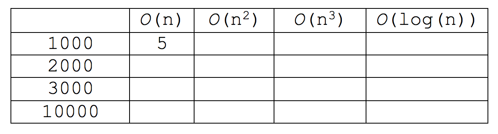

# Exercises for day 1

##Exercise 1 (measure execution time)

Import the file “Collections and Efficiency – demo.zip” (from Fronter) and open the project “time_measure_demo”.

*	Run the program “MeasureSimpleCode”. Compare your observations with your neighbours.
..* What can be concluded?

*	Run with different values of ‘n’. Observe how the execution time varies with “n”.
..* Conclusion?

Note: In this project we have disabled the "Just-in-time compilation”. In NetBeans this is done by:

Right click the project > properties > Run 
set ”VM Options”  to  ”-Djava.compiler=NONE” > OK

##Exercise 2 (another “algorithm”)

Now, add the statement below to the loop in exercise 1 and figure out how execution time varies with “n” after the change.

...n = n/2;

Conclusion?

##Exercise 3 (Time complexity – ‘Big O’ – notation)

Determine the time complexity for the following code fragments.
Use the ’Big O’-notation in your answers. ‘n’ is assumed to be declared and initialized.

```java
  for (int i=0;i<10000;i++)
     	Math.sqrt(i);
```	
```java
for (int i=0;i<n;i++)
	    Math.sqrt(i);		
```

```java
while(1<n)
{
     n=n/2;
     Math.sqrt(n);	
}
```

```java
for (int i=0; i<n; i++)
{
   for (int k=i; k<n; k++)
   {
        Math.sqrt(i);
   }
}
```
##Exercise 4 (Time complexity)

What is the time growth rate (time complexity) of the following method?

```java
public static int count(int[] a, int c)
{
  int count = 0;
  for (int i = 0; i < a.length; i++)
  {
      if (a[i] == c) count++;
  } 
   return count; 
 }
 ```
 
##Exercise 5 (Time complexity)

Suppose an algorithm A takes 5 seconds to handle a dataset of 1000 elements. Fill in the approximate execution time for A depending on the complexity of the algorithm.


##Exercise 6 (Time complexity)

For the following expressions, what is the order of growth (time complexity) of each?
1.	n2+ 2n + 1
2.	n10 + 9n9 + 20n8 + 145n7
3.	n + (0.001)n3
4.	n + log(n)


