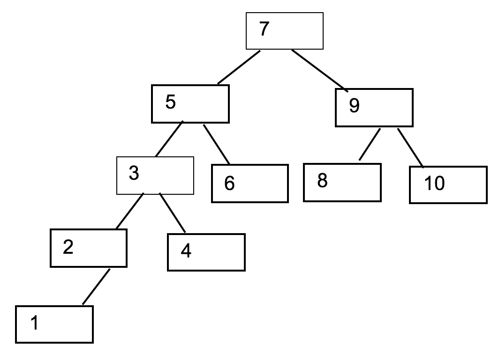

#Day2 Exercises - binary trees and recursion

1. Go to <https://www.cs.usfca.edu/~galles/visualization/BST.html> and play a bit with the animation. 
  Insert a few elements. Find an element, Delete an element.
2. Sketch a binary search tree (on paper) after the insertion of the numbers [ 5,3,2,6,8,9,10 ] in the order shown. 
   Assume that the tree was empty initially.
3. Sketch a (new) binary search tree after insertion of the numbers  [ -1,10,-50,-20,50,4,5,6 ].
4. Sketch a (new) binary search tree after insertion of the numbers [ 1,2,3,4,5,6 ]
5. Order the insertion of the numbers [1,2,3,4,5,6,7 ] into an empty tree, so that the 
resulting tree will have the minimal height possible.
6. Go to http://nova.umuc.edu/~jarc/idsv/ and play a bit with “Traversals” > “Start Exercises”.
Make a tree. Traverse the tree Preorder, Inorder and Postorder.
7. State the order in which the nodes will be visited if the tree from exercise 4 is traversed following the principle inorder, preorder and postorder principle respectively.

  Import the class BinaryTree.java from the note* (**“Recursion and Binary Trees – demo code.zip” / Fronter**).
  * http://cslibrary.stanford.edu/110/BinaryTrees.html#java  (slightly modified)
   
8. Solve Binary Tree Problems 2-6 from Section 2 in the note*.
In each case provide the public method that the client should call and try it out - solutions can be found in the text.

9. Create the tree below using a sequence of calls to the insert menthod:

  
